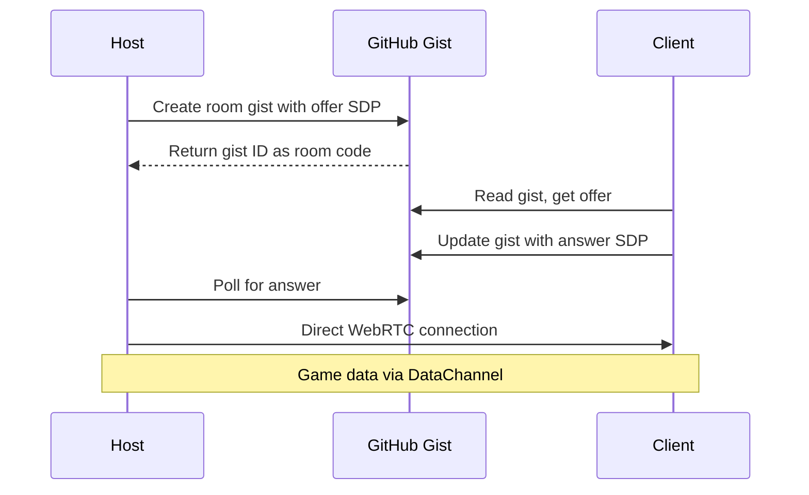

# 3D FPS Game Architecture Plan

## Project Overview

A browser-based 3D first-person shooter game built with Babylon.js, designed for Android and Windows platforms, hosted on GitHub Pages. Features single-player wave survival mode and peer-to-peer multiplayer using GitHub Gist for signaling.

### Key Decisions Made
- **Engine**: Babylon.js (game-focused, built-in physics, better mobile performance)
- **Graphics Style**: Realistic textures with simple geometry
- **Weapons**: Class-based system with 3-4 preset loadouts
- **Enemies**: 4 types (basic, fast, tank, ranged) with progressive introduction
- **Multiplayer**: WebRTC with GitHub Gist signaling (2-5 players, 5-digit room codes)

---

## Project Structure

```
Made/
├── index.html                 # Entry point
├── manifest.json              # PWA manifest for mobile
├── sw.js                      # Service worker for offline
├── src/
│   ├── main.ts                # Game initialization
│   ├── config/
│   │   ├── gameConfig.ts      # Global game settings
│   │   ├── weaponConfig.ts    # Weapon stats and behaviors
│   │   ├── enemyConfig.ts     # Enemy types and stats
│   │   └── classConfig.ts     # Player class definitions
│   ├── core/
│   │   ├── Engine.ts          # Babylon.js engine wrapper
│   │   ├── SceneManager.ts    # Scene lifecycle management
│   │   ├── AssetLoader.ts     # Texture and model loading
│   │   └── AudioManager.ts    # Sound effects and music
│   ├── entities/
│   │   ├── Player.ts          # Player controller and state
│   │   ├── Enemy.ts           # Base enemy class
│   │   ├── enemies/
│   │   │   ├── BasicEnemy.ts  # Standard enemy
│   │   │   ├── FastEnemy.ts   # Quick but weak
│   │   │   ├── TankEnemy.ts   # Slow but tough
│   │   │   └── RangedEnemy.ts # Shoots from distance
│   │   ├── Weapon.ts          # Base weapon class
│   │   └── Projectile.ts      # Bullet/projectile handling
│   ├── systems/
│   │   ├── InputSystem.ts     # Keyboard/mouse/touch input
│   │   ├── PhysicsSystem.ts   # Collision detection
│   │   ├── AISystem.ts        # Enemy pathfinding and behavior
│   │   ├── WaveSystem.ts      # Wave spawning logic
│   │   └── NetworkSystem.ts   # WebRTC and Gist signaling
│   ├── ui/
│   │   ├── HUD.ts             # Health, ammo, crosshair
│   │   ├── Menu.ts            # Main menu
│   │   ├── Settings.ts        # Sensitivity, controls
│   │   ├── TouchControls.ts   # Mobile button overlay
│   │   └── Lobby.ts           # Multiplayer room UI
│   ├── maps/
│   │   ├── MapLoader.ts       # Load map data
│   │   └── maps/
│   │       └── warehouse.json # First map definition
│   └── utils/
│       ├── MathUtils.ts       # Vector math helpers
│       └── StorageUtils.ts    # LocalStorage wrapper
├── assets/
│   ├── models/
│   │   ├── weapons/           # Weapon 3D models
│   │   ├── characters/        # Player and enemy models
│   │   └── environment/       # Map props and structures
│   ├── textures/
│   │   ├── weapons/
│   │   ├── characters/
│   │   └── environment/
│   ├── audio/
│   │   ├── sfx/               # Sound effects
│   │   └── music/             # Background music
│   └── ui/                    # UI sprites and icons
├── dist/                      # Built files for deployment
└── tools/
    └── mapEditor.html         # Simple map creation tool
```

---

## Core Systems Architecture

### 1. Game Engine Setup

```typescript
// Engine initialization flow
class Game {
    private engine: BABYLON.Engine;
    private scene: BABYLON.Scene;
    private assetLoader: AssetLoader;
    
    async initialize(): Promise<void> {
        // 1. Create canvas and engine
        // 2. Configure rendering quality based on device
        // 3. Load core assets
        // 4. Initialize input system
        // 5. Show main menu
    }
}
```

**Rendering Configuration by Platform**:
- **Desktop**: Full resolution, shadows enabled, antialiasing
- **Mobile**: Dynamic resolution scaling, simplified shadows, reduced draw distance

### 2. Player Controller

```typescript
interface PlayerState {
    position: BABYLON.Vector3;
    rotation: BABYLON.Vector2;  // Yaw, Pitch
    velocity: BABYLON.Vector3;
    health: number;
    armor: number;
    isGrounded: boolean;
    isCrouching: boolean;
    isAiming: boolean;
    isSprinting: boolean;
    currentWeapon: Weapon;
    ammo: { current: number; reserve: number };
}
```

**Movement Parameters** (inspired by CoD/PUBG):
- Walk speed: 4.5 m/s
- Sprint speed: 6.5 m/s
- Crouch speed: 2.0 m/s
- ADS speed: 3.0 m/s
- Jump height: 1.2m
- Gravity: -20 m/s^2

**Camera System**:
- First-person camera attached to player head
- Smooth camera transitions for ADS
- FOV: 75 (normal), 45-60 (ADS depending on weapon)
- View bobbing while moving
- Recoil camera shake

### 3. Input System

```typescript
interface InputBindings {
    keyboard: {
        forward: string;      // W
        backward: string;     // S
        left: string;         // A
        right: string;        // D
        jump: string;         // Space
        crouch: string;       // C or Ctrl
        reload: string;       // R
        sprint: string;       // Shift
        interact: string;     // E
    };
    mouse: {
        fire: number;         // Left click
        aim: number;          // Right click
        sensitivity: number;  // 0.1 - 2.0
    };
}
```

**Touch Controls Layout** (PUBG-inspired):
```
┌─────────────────────────────────────────────┐
│ [HP/Armor]           [Ammo]    [Settings]   │
│                                             │
│                  [Crosshair]                │
│                                             │
│                                             │
│ [Crouch]                           [Reload] │
│    ↑                                        │
│  ← ● →    [Sprint]              [AIM][FIRE] │
│    ↓                              [Jump]    │
└─────────────────────────────────────────────┘
```

Touch buttons should be:
- Draggable for custom positioning
- Resizable (small/medium/large)
- Adjustable opacity
- Saved to localStorage

### 4. Weapon System

**Class Definitions**:

| Class | Primary | Secondary | Special | Playstyle |
|-------|---------|-----------|---------|-----------|
| Assault | AR-15 | Pistol | Frag Grenade | Balanced |
| Recon | Sniper | SMG | Smoke Grenade | Long range |
| Breach | Shotgun | Machine Pistol | Flashbang | Close quarters |
| Support | LMG | Pistol | Ammo Pack | Suppression |

**Weapon Stats Structure**:
```typescript
interface WeaponStats {
    damage: number;           // Base damage per hit
    fireRate: number;         // Rounds per minute
    magazineSize: number;     // Bullets before reload
    reserveAmmo: number;      // Starting reserve
    reloadTime: number;       // Seconds
    range: {
        effective: number;    // Full damage range
        maximum: number;      // Damage falloff ends
    };
    recoil: {
        vertical: number;     // Upward kick
        horizontal: number;   // Side-to-side spread
        recovery: number;     // Return to center speed
    };
    adsTime: number;          // Time to aim down sights
    spread: {
        hipfire: number;      // Accuracy from hip
        ads: number;          // Accuracy when aiming
    };
}
```

**Example Weapon - AR-15**:
```typescript
{
    damage: 30,
    fireRate: 700,
    magazineSize: 30,
    reserveAmmo: 120,
    reloadTime: 2.1,
    range: { effective: 40, maximum: 80 },
    recoil: { vertical: 0.3, horizontal: 0.15, recovery: 5 },
    adsTime: 0.25,
    spread: { hipfire: 3.5, ads: 0.8 }
}
```

### 5. Enemy AI System

**Pathfinding**: Babylon.js Navigation Mesh plugin
- Pre-baked navmesh for each map
- Enemies query shortest path to player
- Walls and obstacles automatically avoided
- Dynamic obstacle avoidance for other enemies

**Enemy Types**:

```typescript
interface EnemyType {
    health: number;
    speed: number;
    damage: number;
    attackRange: number;
    attackCooldown: number;
    behavior: 'rush' | 'flank' | 'hold' | 'snipe';
    model: string;
}

const ENEMY_TYPES = {
    basic: {
        health: 100,
        speed: 3.5,
        damage: 15,
        attackRange: 2,
        attackCooldown: 1.0,
        behavior: 'rush',
        model: 'enemy_basic'
    },
    fast: {
        health: 60,
        speed: 6.0,
        damage: 10,
        attackRange: 2,
        attackCooldown: 0.7,
        behavior: 'rush',
        model: 'enemy_fast'
    },
    tank: {
        health: 300,
        speed: 2.0,
        damage: 40,
        attackRange: 2.5,
        attackCooldown: 2.0,
        behavior: 'rush',
        model: 'enemy_tank'
    },
    ranged: {
        health: 80,
        speed: 2.5,
        damage: 20,
        attackRange: 25,
        attackCooldown: 1.5,
        behavior: 'snipe',
        model: 'enemy_ranged'
    }
};
```

**AI State Machine**:
```
[Idle] → (detect player) → [Chase] → (in range) → [Attack]
                              ↓
                    (lost sight) → [Search] → (timeout) → [Patrol]
```

### 6. Wave System

**Wave Configuration**:
```typescript
interface WaveConfig {
    waveNumber: number;
    enemies: {
        type: string;
        count: number;
        spawnDelay: number;  // Seconds between spawns
    }[];
    timeBetweenWaves: number;
    bonusPoints: number;
}

// Example progression
const WAVE_PROGRESSION = [
    { wave: 1, enemies: [{ type: 'basic', count: 5 }] },
    { wave: 2, enemies: [{ type: 'basic', count: 8 }] },
    { wave: 3, enemies: [{ type: 'basic', count: 6 }, { type: 'fast', count: 3 }] },
    { wave: 5, enemies: [{ type: 'basic', count: 8 }, { type: 'fast', count: 4 }, { type: 'tank', count: 1 }] },
    { wave: 7, enemies: [{ type: 'basic', count: 10 }, { type: 'ranged', count: 3 }] },
    // Continue scaling...
];
```

**Spawn System**:
- Multiple spawn points per map (hidden from player view)
- Enemies spawn only if spawn point not visible to player
- Max concurrent enemies: 15 (performance)
- Queue system for additional spawns

### 7. Multiplayer System

**WebRTC + GitHub Gist Architecture**:



**Room Code System**:
- 5-digit alphanumeric code (e.g., "A3X7K")
- Derived from Gist ID (first 5 chars, uppercase)
- Gists are public but unlisted (only accessible with direct link)

**Network Message Types**:
```typescript
type NetworkMessage =
    | { type: 'player_join'; playerId: string; class: string }
    | { type: 'player_leave'; playerId: string }
    | { type: 'player_state'; playerId: string; state: PlayerState }
    | { type: 'player_shoot'; playerId: string; origin: Vector3; direction: Vector3 }
    | { type: 'player_hit'; targetId: string; damage: number }
    | { type: 'game_start'; mapId: string; settings: GameSettings }
    | { type: 'wave_start'; waveNumber: number }
    | { type: 'enemy_spawn'; enemyId: string; type: string; position: Vector3 }
    | { type: 'enemy_state'; enemyId: string; position: Vector3; health: number }
    | { type: 'enemy_death'; enemyId: string; killerId: string };
```

**Authority Model**:
- Host is authoritative for:
  - Wave spawning
  - Enemy AI and positions
  - Hit validation
- Clients own their player state
- Host validates damage and awards kills

**Gist Signaling Implementation**:
```typescript
class GistSignaling {
    private gistId: string;
    private personalAccessToken?: string;  // Optional, for write access
    
    async createRoom(): Promise<string> {
        // Create anonymous gist via GitHub API
        // Store WebRTC offer
        // Return room code
    }
    
    async joinRoom(code: string): Promise<RTCSessionDescription> {
        // Fetch gist by code
        // Return host's offer
    }
    
    async sendAnswer(answer: RTCSessionDescription): Promise<void> {
        // Update gist with answer
    }
}
```

**Limitations**:
- GitHub API rate limits (60 requests/hour unauthenticated)
- Connection setup may take 5-10 seconds
- No TURN server fallback (some NATs won't connect)

### 8. UI/HUD System

**HUD Elements**:
```typescript
interface HUDConfig {
    crosshair: {
        style: 'dot' | 'cross' | 'circle' | 'dynamic';
        color: string;
        size: number;
    };
    health: {
        style: 'bar' | 'numeric' | 'both';
        position: 'bottom-left' | 'top-left';
    };
    ammo: {
        position: 'bottom-right';
        showReserve: boolean;
    };
    minimap: {
        enabled: boolean;
        size: number;
        zoom: number;
    };
    killFeed: {
        enabled: boolean;
        maxEntries: number;
    };
}
```

**Settings Menu Structure**:
```
Settings
├── Controls
│   ├── Mouse Sensitivity (0.1 - 2.0, default 1.0)
│   ├── ADS Sensitivity Multiplier (0.5 - 1.5)
│   ├── Invert Y-Axis (on/off)
│   └── Key Bindings (rebindable)
├── Touch Controls (mobile only)
│   ├── Button Size (small/medium/large)
│   ├── Button Opacity (25% - 100%)
│   ├── Layout Editor (drag to reposition)
│   └── Gyroscope Aiming (on/off)
├── Graphics
│   ├── Quality Preset (low/medium/high/ultra)
│   ├── Resolution Scale (50% - 100%)
│   ├── Shadows (off/low/medium/high)
│   ├── Anti-Aliasing (off/FXAA/MSAA)
│   └── FOV (60 - 120)
├── Audio
│   ├── Master Volume
│   ├── SFX Volume
│   ├── Music Volume
│   └── Voice Chat Volume (multiplayer)
└── Gameplay
    ├── Crosshair Customization
    ├── HUD Scale
    └── Show FPS Counter
```

---

## Asset Requirements

### 3D Models Needed

| Asset | Polygon Budget | Notes |
|-------|---------------|-------|
| Player Arms | 5,000 | First-person view only |
| AR-15 | 3,000 | With attachments |
| Sniper Rifle | 3,500 | Scope detail |
| Shotgun | 2,500 | Pump action |
| LMG | 4,000 | Belt-fed |
| Pistol | 1,500 | All classes |
| SMG | 2,000 | Recon secondary |
| Basic Enemy | 4,000 | Humanoid |
| Fast Enemy | 3,500 | Lighter armor look |
| Tank Enemy | 6,000 | Heavy armor |
| Ranged Enemy | 4,500 | With weapon |
| Map Props | 500-2,000 | Crates, barrels, etc. |
| Map Structures | 5,000-20,000 | Buildings, walls |

### Textures

- Resolution: 1024x1024 for weapons, 2048x2048 for environment
- Format: WebP for smaller file size, PNG fallback
- PBR textures: Albedo, Normal, Roughness/Metallic combined

### Audio

| Sound | Format | Notes |
|-------|--------|-------|
| Weapon Fire | MP3 | Per weapon, 3 variations |
| Reload | MP3 | Per weapon |
| Footsteps | MP3 | 4 surfaces x 4 variations |
| Jump/Land | MP3 | 2 variations each |
| Enemy Sounds | MP3 | Idle, alert, attack, death |
| UI Clicks | MP3 | Menu navigation |
| Ambient | MP3 | Loop per map |

---

## Implementation Phases

### Phase 1: Core Foundation
- [ ] Project setup with TypeScript and bundler
- [ ] Babylon.js engine initialization
- [ ] Basic scene with ground plane
- [ ] First-person camera controller
- [ ] WASD movement with physics
- [ ] Mouse look with sensitivity
- [ ] Jump and crouch mechanics
- [ ] Basic collision detection

### Phase 2: Combat System
- [ ] Weapon base class
- [ ] Shooting mechanics with raycasting
- [ ] Recoil and spread implementation
- [ ] Reload system with animations
- [ ] ADS (aim down sights) camera
- [ ] Hit detection and damage
- [ ] Weapon switching
- [ ] Class system with loadouts

### Phase 3: Enemy AI
- [ ] Navigation mesh generation
- [ ] Enemy base class
- [ ] Pathfinding to player
- [ ] Attack behavior
- [ ] 4 enemy type variations
- [ ] Spawn system
- [ ] Death and despawn

### Phase 4: Wave Mode
- [ ] Wave configuration system
- [ ] Progressive difficulty
- [ ] Wave UI (wave number, enemies remaining)
- [ ] Between-wave timer
- [ ] Score tracking
- [ ] Game over screen
- [ ] High score storage

### Phase 5: Map and Environment
- [ ] Map JSON format design
- [ ] Map loader
- [ ] First playable map (warehouse)
- [ ] Lighting setup
- [ ] Props and cover placement
- [ ] Spawn point configuration
- [ ] Navmesh baking

### Phase 6: UI/HUD
- [ ] Health and armor display
- [ ] Ammo counter
- [ ] Crosshair system
- [ ] Main menu
- [ ] Settings menu
- [ ] Pause menu
- [ ] Mobile touch controls overlay
- [ ] Touch control customization

### Phase 7: Polish
- [ ] Sound effects integration
- [ ] Particle effects (muzzle flash, impacts)
- [ ] Screen effects (damage, low health)
- [ ] View bobbing
- [ ] Weapon sway
- [ ] Performance optimization
- [ ] Mobile-specific optimizations

### Phase 8: Multiplayer
- [ ] WebRTC connection setup
- [ ] GitHub Gist signaling
- [ ] Room creation/joining UI
- [ ] Player synchronization
- [ ] Networked shooting
- [ ] Host migration (if host leaves)
- [ ] Lobby system
- [ ] Co-op wave mode

### Phase 9: Deployment
- [ ] Build optimization
- [ ] GitHub Pages deployment
- [ ] PWA manifest for mobile
- [ ] Service worker for offline
- [ ] Testing on multiple devices
- [ ] Performance profiling

---

## Technical Considerations

### Performance Targets
- Desktop: 60 FPS at 1080p
- Mobile: 30 FPS at 720p
- Load time: < 10 seconds on 4G
- Bundle size: < 5MB (excluding assets)

### Mobile Optimization
- Dynamic resolution scaling
- Reduced shadow map size
- Simplified particle effects
- Touch-optimized UI (larger hit areas)
- Gyroscope aiming option

### Browser Compatibility
- Chrome 80+ (Windows, Android)
- Firefox 75+ (Windows)
- Safari 14+ (iOS - limited WebRTC)
- Edge 80+ (Windows)

### Known Challenges

1. **GitHub Gist Rate Limits**: Anonymous API calls limited to 60/hour. May need users to provide personal access token for multiplayer.

2. **WebRTC NAT Traversal**: Without a TURN server, some users behind strict NATs won't connect. Consider documenting this limitation.

3. **Asset Loading**: 3D models and textures are large. Implement progressive loading with loading screen.

4. **Mobile Safari**: Audio autoplay restrictions require user interaction before playing sounds.

5. **Touch Input Precision**: Aiming on mobile is harder. Consider aim assist options.

---

## Code Style Guidelines

- No unnecessary comments (code should be self-documenting)
- No placeholder or TODO comments in production
- TypeScript strict mode enabled
- ESLint with recommended rules
- Prettier for formatting
- Descriptive variable and function names
- Small, focused functions
- Composition over inheritance where practical

---

## External Resources to Reference

### Open Source FPS Games
- Krunker.io (browser-based FPS, excellent mobile controls)
- BananaBread (Cube 2 engine ported to WebGL)
- Three.js FPS examples

### Babylon.js Resources
- Official documentation: https://doc.babylonjs.com/
- FPS game tutorial: Babylon.js Playground examples
- Navigation mesh plugin documentation

### Assets (Free/Open Source)
- Quaternius (CC0 3D models)
- Kenney.nl (game assets)
- OpenGameArt.org
- Freesound.org (audio)

---

## Next Steps

1. Switch to Code mode to initialize the project
2. Set up TypeScript with bundler (Vite recommended)
3. Create basic Babylon.js scene
4. Implement player controller
5. Iterate through phases

---

*This plan is designed to be continued by another AI or developer. Each phase is self-contained with clear deliverables. The architecture supports incremental development while maintaining a clear vision of the final product.*
